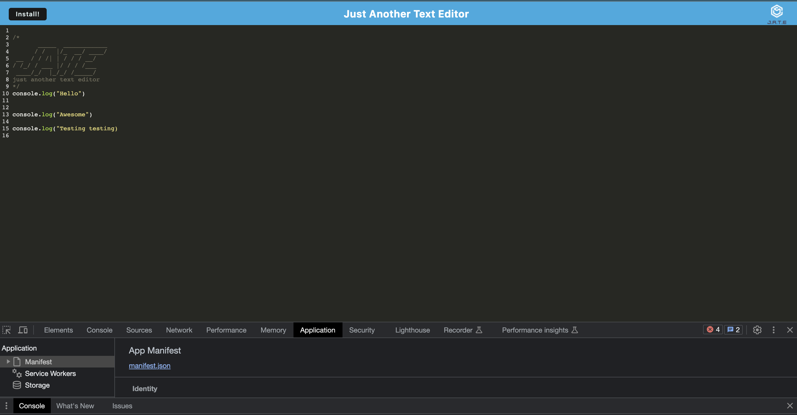
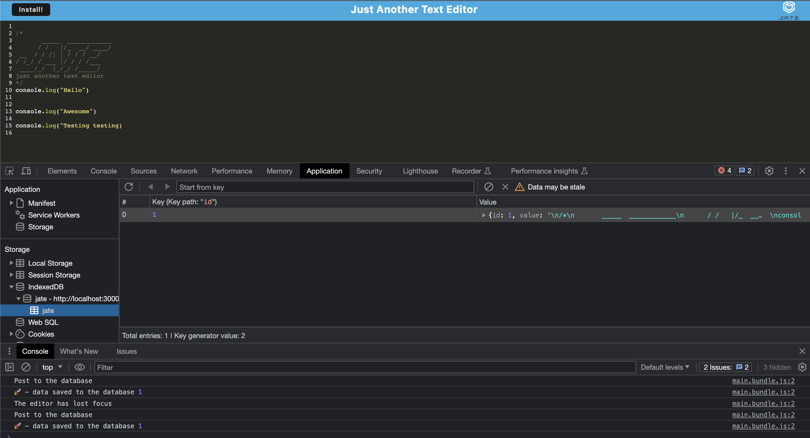
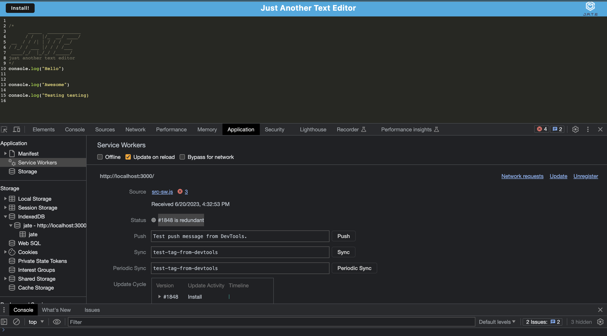

# WriteChoice

## Description

<!-- 

 -->

This project represents a culmination of several advanced web development concepts, resulting in a robust, browser-based text editor application. As a fully realized Progressive Web App (PWA), the editor offers seamless online and offline functionality. One of the main highlights of the project is its innovative use of multiple data persistence techniques to ensure reliable data storage and accessibility. The application leverages the IndexedDB API through the use of 'idb', a lightweight package trusted by Google and Mozilla, offering advanced data retrieval and storage methods. Deployed on Heroku, this project epitomizes the principles of full-stack development, with a special focus on data persistence and progressive web app standards.

## Table of Contents    
- [Description](#description)
- [Repo URL](#repo-url)
- [Installation](#installation)
- [Usage Information](#usage-information)
- [Contribution Guidelines](#contribution-guidelines)
- [Test Instructions](#test-instructions)
- [License](#license)
- [Screenshots](#screenshots)

## REPO URL
[Repository URL](https://github.com/cmcnamara15/WriteChoice) 

## Installation
Deployment: The application is deployed on Heroku. Visit the Heroku link to access the live application. 

## Usage Information
Launch: Access the text editor through the browser by visiting the deployed link. If you want to use it offline, add the application to your home screen. On supported devices, the browser will prompt you to install the application.

Upon Opening: Once the text editor is opened, you'll find that IndexedDB has immediately created a database storage. When content is entered and you click
out of the DOM window you'll find that the content has been saved in IndexedDB.

Saving your document: No need to manually save your document - the application automatically saves your work in real time. Your document is stored safely in an IndexedDB database.

Accessing your document offline: If you are offline, you can still access your saved documents. Just open the application, and your documents will be available for you to view and edit. Any changes you make while offline will be saved and synced when you are back online.

 

## Contribution Guidelines 
Contribution: If you want to contribute to the project, clone the repository, make your changes, and submit a pull request. Please ensure to follow the coding standards outlined in the project documentation. 

## License

## Questions 
If you have any questions please feel free to reach out. 

Github: [cmcnamara15](https://github.com/cmcnamara15) 
Email: cmcnamara1991@icloud.com
LinkdIn: [cmcnamara15](https://www.linkedin.com/in/chris-mcnamara1991/)

## Screenshots

The following screenshots shows the apps functionality. 

## J.A.T.E open in browser 

 

 

